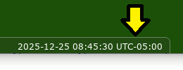

# Stellarium Messier Marathon Script

This project provides you with a script that can be easily run in Stellarium to help simulate and plan for an upcoming Messier Marathon challenge!

In addition, this script will provide helpful information specific to your marathon, including a much-needed customized time schedule of the exact time when to be looking for each individual Messier object.

There are other Messier Marathon scripts for Stellarium out there on the internet - including one that is already included with Stellarium.  However, this script is specifically designed to help you plan and accomplish your very own specific Messier Marathon!

If you already have a good idea of the order of finding each of the 110 Messier objects prior to using this script, running this Stellarium script may also help you to refine your order.

While the main audience for this script is for astronomers who wish to complete a Messier Marathon without the aide of any type of computerized telescope, anyone is welcome to experiment with this script!

Here is a brief example of what this script looks like in Stellarium:


---

<br>

# Table of Contents

* [Background Information](#background-information)
* Instructions
    * [Starting and Running the Script](#starting-and-running-the-script)
    * [When The Script Finishes](#when-the-script-finishes)
    * [Optional](#optional)
    * [Additional Option](#additional-option)
    * [Final Steps](#final-steps)
* Editing the Script Variables
    * [marathonDate](#1-marathondate)
    * [sunSetAlt](#2-sunsetalt)
    * [sunRiseAlt](#3-sunrisealt)
    * [waitSecondsBetweenSelections](#4-waitsecondsbetweenselections)
    * [saveToOutputFiles](#5-savetooutputfiles)
    * [MyMessierList](#6-mymessierlist)
    * [MinutesDurations](#7-minutesdurations)
    * [MessierChartNum](#8-messierchartnum)
* FAQ
    * [What limitations are there with the sunset and sunrise altitude variables?](#what-limitations-are-there-with-the-sunset-and-sunrise-altitude-variables)
    * [Can I regain the GUI while the script is running?](#can-i-regain-the-gui-while-the-script-is-running)
    * [Can I clean up the labels and markers after the script is done?](#can-i-clean-up-the-labels-and-markers-after-the-script-is-done)
    * [I edited the script to have it generate the TXT and CSV files.  Where are they located?](#i-edited-the-script-to-have-it-generate-the-txt-and-csv-files--where-are-they-located)
    * [I edited the script to have it generate the TXT and CSV files.  How do I use them?](#i-edited-the-script-to-have-it-generate-the-txt-and-csv-files--how-do-i-use-them)
    * [Why is the script either starting or ending at the wrong time?](#why-is-the-script-either-starting-or-ending-at-the-wrong-time)
    * [What is the script doing at the very beginning?](#what-is-the-script-doing-at-the-very-beginning)
    * [Can I use this script for a "Messier Mini-Marathon"?](#can-i-use-this-script-for-a-messier-mini-marathon)
    * [Can I perform a "Messier Mini-Marathon" any time of the year?](#can-i-perform-a-messier-mini-marathon-any-time-of-the-year)
    * [Is there a perfect order to observing the Messier objects in a Messier Marathon?](#is-there-a-perfect-order-to-observing-the-messier-objects-in-a-messier-marathon)
    * [Can I configure the script to my own tastes?](#can-i-configure-the-script-to-my-own-tastes)
    * [Can I use this script for objects that are not Messier objects?](#can-i-use-this-script-for-objects-that-are-not-messier-objects)
    * [What programming language is used in this script?](#what-programming-language-is-used-in-this-script)
    * [Are there any secrets in the script?](#are-there-any-secrets-in-the-script)
    * [Are there any technical issues?](#are-there-any-technical-issues)

<br>

# Background Information

[Charles Messier](https://science.nasa.gov/people/explore-the-night-sky-hubbleatms-messier-catalog-bio/), a French astronomer in the latter half of the 1700's, was fascinated about discovering comets.  Occasionally, he would come across various dimly illuminated patches in the night sky while looking through his telescope. After further studying these patches, he would determine these patches were not comets, but rather some other type of object.  He made note of these particular objects in a catalog to avoid observing these non-comet objects again.

There are 110 objects in the [Messier Catalog](https://science.nasa.gov/mission/hubble/science/explore-the-night-sky/hubble-messier-catalog/) designated _M1_ to _M110_.

Fast forward to the 20th century, and amateur astronomers took Messier's catalog to heart.  Although there have been a vast number of other catalogs created since Messier's, amateur astronomers developed a particular fascination with Messier's catalog.

At some point in time, it was discovered that it may be possible to see all 110 of Messier's objects in a single night (the _entire_ night from sunset to sunrise). This challenge became known as the [Messier Marathon](https://southplainsastronomy.org/2022/03/03/messier-marathons/).

The most ideal night of a Messier Marathon will usually fall around the last two weeks of March. It is strongly encouraged to take the [phase of the Moon](https://moonphases.co.uk/moon-calendar) into account. Plan on a night around a new moon as even the slightest amount of light from a tiny crescent moon may prevent some of the faintest of Messier's objects to be observable.

The location of where a Messier Marathon will take place is very important. The most ideal location on Earth may have a latitude between 12°N to 26°N. However, a latitude within the range of 8°N to 36°N may also provide a decent opportunity for a successful marathon. Any marathon location with a latitude outside of 4°N to 40°N will not have any realistic chance for a successful marathon. An excellent view of the horizon to both the East and West (and possibly to the South) will also be necessary. The location should also be free from [light pollution](https://lightpollutionmap.app/) as much as possible. A [Bortle Class](https://telescope.live/blog/bortle-scale) 4 sky may be adequate depending on the latitude and elevation of the location, the size and quality of your telescope and the current seeing conditions.  All of these factors come into play in determining your chance of successfully completing a Messier Marathon.

During the marathon, a log should be used to make notes of every Messier object discovery.

It is very important to know that a good amount of planning and practice will be necessary prior to attempting a Messier Marathon. This Stellarium script can help with some of the planning. It is also strongly advisable to attempt a few "Messier Mini-Marathons" throughout the year to get acquainted with finding all of the Messier objects. Good luck!
<br>
<br>

# Instructions

The following instructions below are ideal for those who are more of a novice with computers.  Tech-savvy people should already know how to run a script in [Stellarium](https://stellarium.org/). Although there are a number of ways to run a script in Stellarium, only one method will be described here. Feel free to experiment on how best to run this script.  It is assumed Stellarium is already installed prior to starting these instructions and some very basic knowledge of Stellarium is understood.

### Starting and Running the Script

* Download the `messier_marathon_simulation.ssc` SSC script file directly to your computer:
   - Right-click this [link](https://github.com/StellariumScripts/stellarium-messier-marathon/raw/refs/heads/main/messier_marathon_simulation.ssc) and select "Save link as...".
* Start Stellarium.
* In Stellarium, locate and go to the exact location on Earth where the marathon will take place.
* Press the `[F12]` key on your keyboard to bring up the Script Console window in Stellarium.
* Begin the search for the SSC script file:
   - Click the  icon in the top-left of the Script Console window.
* Search for and open the downloaded SSC script file.
* Make any desirable edits to the script under the "Script" tab:
   - See instructions further below on editing the script variables.
   - However, it is perfectly fine to run the script without any edits if wanting to simply test the script.
* Play the script:
   - Click the  icon near the top-right of the Script Console window.
* The entire Script Console window may be closed now while the script is running:
   - Click the  in the top-right of the Script Console window.
* It may take several minutes for the entire script to finish.

### When The Script Finishes

* Press the `[F12]` key on your keyboard to bring up the Script Console window again.
* Click the "Output" tab to see helpful information pertaining to your specific marathon.

### Optional

* In the "Output" tab of the Script Console window, a portion of the output data is the CSV information that can be used to create a very helpful time schedule.
* The CSV information is all located under the `------- CSV -------` line.
* This CSV information can be copied and pasted into a regular empty text file on your computer.
* The text file should then be saved with a `.csv` extension to its filename.
* This new CSV text file may be opened up in any standard spreadsheet program.
* This spreadsheet will now contain the valuable time schedule of when to find each of the objects and has information on each of the objects.


### Additional Option

A further option is to have the script automatically save the final output to two different text files - a TXT file and a CSV file. (See instructions further below regarding the `saveToOutputFiles` variable to enable this feature.) The benefit of generating these two text files is that copying and pasting the CSV information from the Script Console into a text file as described above would no longer be necessary as the same information would automatically be saved in the generated CSV file. The other automatically generated file - the TXT file - will simply contain all of the information from the "Output" tab.

### Final Steps

If any edits to the script have been made to your liking in the Script Console window, it is best to make those same edits to the downloaded SSC script file.  Any future execution of the script will no longer have to be manually edited in the Script Console window as the edits would already be present in the SSC script file.
<br>
<br>

# Editing the Script Variables

While the script can be run successfully without any edits to the script, you will actually need to make some edits to the script to customize it for your particular Messier Marathon. Near the top of the script are a few variables that will need to be edited. While the edits may be made directly within the Script Console window, those same edits should be made later to the SSC script file itself. The following will describe each of these variables and how they may be edited.

---

### 1. `marathonDate`

This is the night the marathon starts.  Be sure to keep the date in this format: "YYYY-MM-DD"

---

### 2. `sunSetAlt`

The script will start the marathon at the exact moment the Sun is at a particular altitude below the horizon just _after sunset_.  Set this variable to the desired value (in degrees) of how far below the horizon the Sun should be at sunset before considering it dark enough to start the marathon. The value must always be a negative value. It may be common to have this value the same as the `sunRiseAlt` value (see below).

---

### 3. `sunRiseAlt`

The script will end the marathon at the exact moment the Sun is at a particular altitude below the horizon just _before sunrise_.  Set this variable to the desired value (in degrees) of how far below the horizon the Sun should be at sunrise before considering it too bright to continue the marathon. The value must always be a negative value. It may be common to have this value the same as the `sunSetAlt` value (see above).

---

### 4. `waitSecondsBetweenSelections`

This is the length of real time (in seconds) the simulation will spend on each Messier object.  To make the simulation run slower, increase the default time of `1.5` seconds to a higher value.  To make the simulation run faster, decrease the default time of `1.5` seconds to a lower value. The value must be greater than `0`. Note that this is a purely cosmetic option and does not alter the outcome results of the script.

---

### 5. `saveToOutputFiles`

In addition to the output appearing in the "Output" tab in the Script Console, this script can also save the output to two different files - one with a `.txt` extension, and the other with a `.csv` extension. The TXT file simply contains all of the exact same information found in the "Output" tab when the script finishes.  The CSV file is just a subset of the "Output" tab information.  Therefore, the CSV file only contains the CSV portion of the total output.  The filenames are time-stamped (using the exact time the script started) for convenience so the script can be run multiple times and the resulting output files will not be overwritten.

If you want to enable the option of saving the output to these two files, simply change the value of this variable from the default value of `no` to `yes`. It is recommended you do enable this feature by changing this value to `yes`.

---

### 6. `MyMessierList`

This list contains your desired order of finding each Messier object.  If you have not come up with your own order, then you may start with the default list already present in this script or find another order someone else on the internet has derived. When updating this list, please pay attention to the syntax and punctuation.  Every line in this list should look very similar to this:

```
   "M101",
```

---

### 7. `MinutesDurations`

If it is believed a particular Messier object may take considerably more or less time than the average length of time to find, then it may be best to enter the time needed (in terms of minutes) for finding that Messier object in this `MinutesDurations` list. For reference, the typical average amount of time needed to find a Messier object may be around 5 minutes. Any Messier object either missing from this list or assigned the value of `0` will automatically be allocated an average length of time by the script. Note that the order of the Messier objects in this list is not important, nor is it even required to have _any_ Messier object listed in this list.

It is purely optional to do any editing to this `MinutesDurations` list. You may leave every value in this list set to the default value of `0`.

**Examples:**

If M83 is difficult for you to find and takes about 10 minutes to find, the line for M83 should be edited/added to look exactly as such:

```
"M83" : 10,
```

If M45 is easy for you to find and only takes about 30 seconds to find, the line for M45 should be edited/added to look exactly as such:

```
"M45" : 0.5,
```

**Tips:**

* As more updates are done to this `MinutesDurations` list, the resulting time schedule will become more true to the schedule you will need to follow during the actual marathon.

* You can actually build in a few rest periods during the night by giving a few Messier objects a lengthy time of observation - possibly 15 or 20 minutes. Even though that amount of time would not be needed to actually find the object, the extra amount of time given to two or three Messier objects will allow you to stay on schedule while also taking some breaks during the marathon.

---

### 8. `MessierChartNum`

This list is another purely optional list. The purpose of this list is to output a star chart designation for each Messier object with the rest of the CSV information. If the method of finding the Messier objects is using a star atlas, this output can be helpful to have with the time schedule. As you proceed through the marathon during the night, it may make it easier to quickly know which start chart contains the next Messier object you are to find. The default values with this script are the chart numbers from _Sky & Telescope's Pocket Sky Atlas_.

**Example:**

If M104 is on chart 47 of your particular sky atlas, then the M104 line should look exactly as such:

```
"M104" : "47",
```

<br>

# FAQ

Here you can possibly get answers to some questions as well as learn a little more about the script.

## What limitations are there with the sunset and sunrise altitude variables?

It is generally assumed the altitude values for the `sunSetAlt` or `sunRiseAlt` variables will be set somewhat close to the actual sunset and sunrise and below the horizon.  However, if deemed necessary, both the `sunSetAlt` or `sunRiseAlt` variables can be set to an altitude value when the Sun is near (but not exceeding) the lowest possible altitude the Sun can reach below the horizon during the middle of the night. The `sunSetAlt` variable can be set to an altitude value just before the Sun reaches this lowest possible altitude.  Conversely, the `sunRiseAlt` variable can be set to an altitude value just after the Sun passed the lowest possible altitude.

Because of this limitation described above, there is a chance this script will fail to simulate a very short marathon that will either start very late at night or end very early at night.  However, it will be mentioned that the script could be forced to start or stop at any specific time by using the `forceStartTime` and `forceEndTime` variables found in the script.  (These two variables will not receive any more documentation in this README file.)
<br>
<br>

## Can I regain the GUI while the script is running?

Yes. While the script is running, the Stellarium GUI disappears and does not reappear until the moment the script finishes.  If the GUI is needed while the script is running, simply use this 2-key combination on your keyboard: `CTRL` + `t`
<br>
<br>

## Can I clean up the labels and markers after the script is done?

Yes. In the Script Console (press `[F12]`), run these two lines of code in the Script tab:

```
LabelMgr.deleteAllLabels();
MarkerMgr.deleteAllMarkers();
```

Of course, a simple restart of Stellarium will not only clean up the labels and markers, but return all of Stellarium to your default state.
<br>
<br>

## I edited the script to have it generate the TXT and CSV files.  Where are they located?

If you set the `saveToOutputFiles` variable in the script to `yes`, then the script will output two text files at the completion of the script.  Here are where the two text files should be located:

* In Windows:
    * `C:\Users\<your username>\AppData\Roaming\Stellarium`
* In Linux:
    * `~/.stellarium`
* In macOS:
    * `~/Library/Application Support/Stellarium`

The filenames of the two generated files will have a time stamp of when the script was started. The two filenames will follow these patterns:
```
MessierMarathon_YYYY-MM-DD_HH-MM-SS.csv
MessierMarathon_YYYY-MM-DD_HH-MM-SS.txt
```

## I edited the script to have it generate the TXT and CSV files.  How do I use them?

If you set the `saveToOutputFiles` variable in the script to `yes`, then the script will output two text files at the completion of the script.

One of the files is a TXT file (with a `.txt` file extension) that contains all of the same exact information in the "Output" tab of the Script Console once the script has finished.

The other file is a CSV file (with a `.csv` file extension) . This CSV file will simply contain the bottom portion of the output in the TXT file. CSV files can be inherently opened by any spreadsheet program such as Microsoft Excel, LibreOffice Calc, Google Sheets or even an [online CSV viewer](https://codebeautify.org/csv-viewer). When the CSV file has been opened in a spreadsheet program, you will have nicely organized data in tabular form in rows and columns.  More importantly, this CSV data provides the very useful time schedule that will help you stay on schedule during the entire Messier Marathon.

A few notes regarding the CSV file:
* When the CSV file is opened in a spreadsheet program, a few of the columns may be deemed to not be necessary.  Simply delete those columns.
* Any remaining columns may be shifted either to the left or right of each other.
* The Altitude and Azimuth columns are the Alt/Az coordinates of the Messier object at the exact observation time indicated for that Messier object.

For further help with CSV files, here is one of many [CSV tutorials](https://tadabase.io/blog/what-is-a-csv) on the internet.
<br>
<br>

## Why is the script either starting or ending at the wrong time?

The most likely cause of this issue is due to an incorrect setting with the time zone in Stellarium. After choosing the location in Stellarium where the Messier Marathon will take place, make note of the UTC time offset at the very bottom of the Stellarium program.



Ensure the UTC offset is correct for both that location and date (is Daylight Saving in effect?).  If the UTC time offset is not correct, it is quite possible a custom time zone has been incorrectly set in Stellarium's "Location" settings.  If a custom time zone is set, also be sure to be aware of any possible Daylight Saving effect.
<br>
<br>

## What is the script doing at the very beginning?

Immediately after the script is started (while "Messier Marathon" is displayed on the screen), the script is doing some quick calculations to determine the exact start and end times of the Marathon for your particular location and date. The start and end times are based on the values set for both the `sunSetAlt` and `sunRiseAlt` values. The calculations should only take a few seconds.
<br>
<br>
## Can I use this script for a "Messier Mini-Marathon"?

Yes. There is absolutely no restriction to the number of Messier objects this script will use.  This allows you to perform a marathon consisting fewer than the entire catalog of 110 objects. In the `MyMessierList` list, simply add or remove Messier objects as deemed fit.  The script will automatically make any adjustments based on whatever number of Messier objects happen to be listed in the `MyMessierList` list. Please make note of the limitations to the values for the sunset and sunrise altitude variables already mentioned above.
<br>
<br>

## Can I perform a "Messier Mini-Marathon" any time of the year?

Yes. It is possible to perform a Messier Mini-Marathon any night of the year.  As many as 90 or more Messier objects may be visible throughout an entire night any night of the year. (Exact number is date and latitude dependent.) As mentioned earlier, take the [phase of the Moon](https://moonphases.co.uk/moon-calendar) in consideration.

A Messier Mini-Marathon does not even have to take an entire night. Begin practicing for the real Messier Marathon by doing short marathons consisting of possibly 20 or so Messier objects.
<br>
<br>

## Is there a perfect order to observing the Messier objects in a Messier Marathon?

No. Absolutely not! It can actually be quite challenging to determine an order that could even be considered close to perfect. This is especially true for the Messier objects close to the horizon near sunset and sunrise. While the default order included with this script may provide a decent start, it should be up to you to find a order that suits you best. Continually change the order of the Messier objects in this script to test your own order and determine if it is ideal for you.

Some factors in deciding the order may include the date and location of your Messier Marathon in addition to your level of comfort in finding particular Messier objects.

A large component of the fun that goes into a Messier Marathon is determining your own sequence of Messier objects to find.
<br>
<br>

## Can I configure the script to my own tastes?

Yes. Feel free to make edits to the script.  The script is commented fairly well. A little bit of common sense may even help to understand what a particular line of code is doing.  Do not worry.  Editing the script will not "damage" your Stellarium program. If Stellarium is ever in a state of confusion, simply restart Stellarium.
<br>
<br>

## Can I use this script for objects that are not Messier objects?

Yes. Despite the emphasis of using this script for Messier objects, essentially any object in the night sky can be entered in the `MyMessierList` variable list. This flexibility gives you the opportunity to observe a custom list of non-Messier objects in the night sky. The one thing to make certain is to use the identical naming of the object that Stellarium uses. Please understand that there will be some `undefined` fields for any of the non-Messier objects in the final output. For any tech-savvy person, to remove the `undefined` outputs, update the `MessierChartNum`, `MessierObjectType`, and `typeInitialsLookup` lists located throughout the code.
<br>
<br>

## What programming language is used in this script?

The programming language used in this script is called [JavaScript](https://www.w3schools.com/js/). Edits to the script can be done and saved in Stellarium's Script Console window. However, if wanting to make edits to the script outside of the Stellarium program, a good suggestion would be to open the SSC script file with [Notepad++](https://notepad-plus-plus.org/) (or a similar type of advanced text editor).  After the SSC script file is opened with Notepad++, in the top menu of Notepad++ select:

> **Language**  **J**  **JavaScript**
<br>

## Are there any secrets in the script?
Yes! Take a look around in the script for a few undocumented variables you may wish to use.
<br>
<br>

## Are there any technical issues?

This script was first publicly released when Stellarium 25.4 was the latest stable version.  Depending on the operating system you are using, you may need to pay attention to the following issues:

* **Windows**
   * There should be no issue running this script in Stellarium 25.1 or earlier in Windows.
   * If running this script in Stellarium 25.2 or later, an edit to any generated text file may need to be done in the event you happen to see the `Â` character near every degree symbol (`°`). Here is one method to remove this `Â` character in Windows:
      * Open the text file with Windows Notepad.
      * At the top menu, select: "File"  "Save As"
      * The "Save As" dialog box will appear.
      * Near the "Save" button, click the "Encoding" drop-down menu and select "ANSI".

      * Click "Save".
      * Click "Yes" when asked to replace the file.
      * Windows Notepad may be closed now.
      * Now, make another attempt at opening the edited text file in either a text file program or a spreadsheet program.
      * The `Â` character should no longer be visible.
* **Linux** - Stellarium 25.1 (and earlier) in Linux has an issue when saving the output to the text files after setting the `saveToOutputFiles` variable to `yes`. If using Linux, and if it is desired to use this script to save the output to the two CSV and TXT text files, please use Stellarium version 25.2 or higher.
* **macOS** - The author of this script has no access to a macOS operating system, and therefore this script was never tested on an Apple computer. Sorry!
<br>

---
---

## Need some help or see an issue? You may [ask a question](https://github.com/StellariumScripts/stellarium-messier-marathon/discussions) or [submit an issue](https://github.com/StellariumScripts/stellarium-messier-marathon/issues).
<br>

---
---
